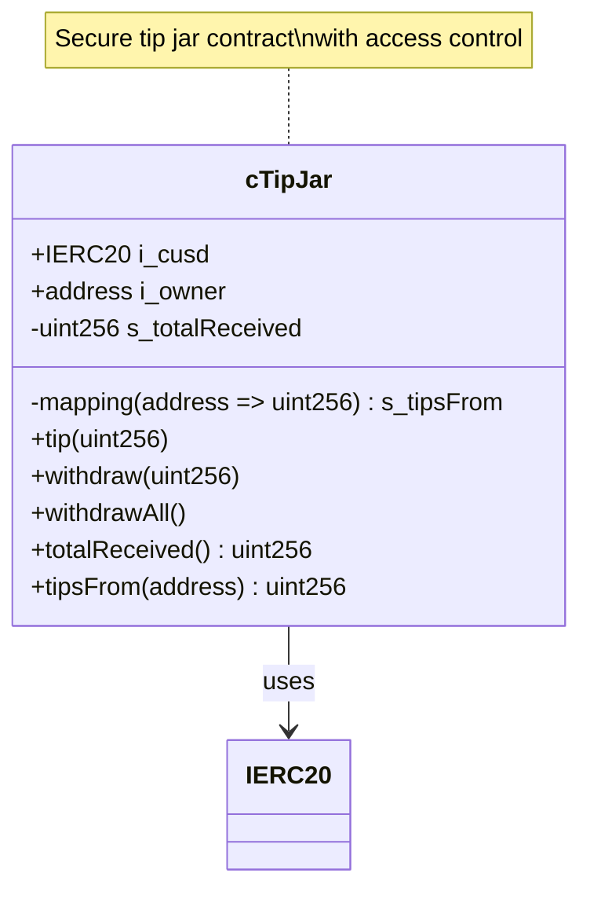
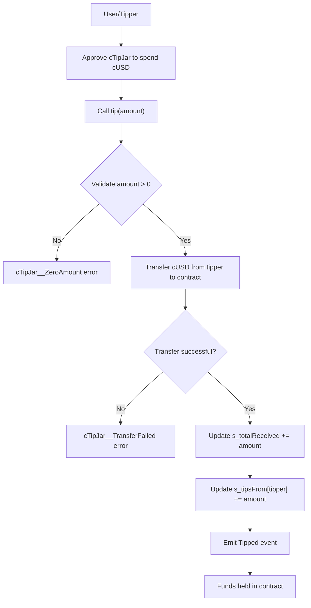
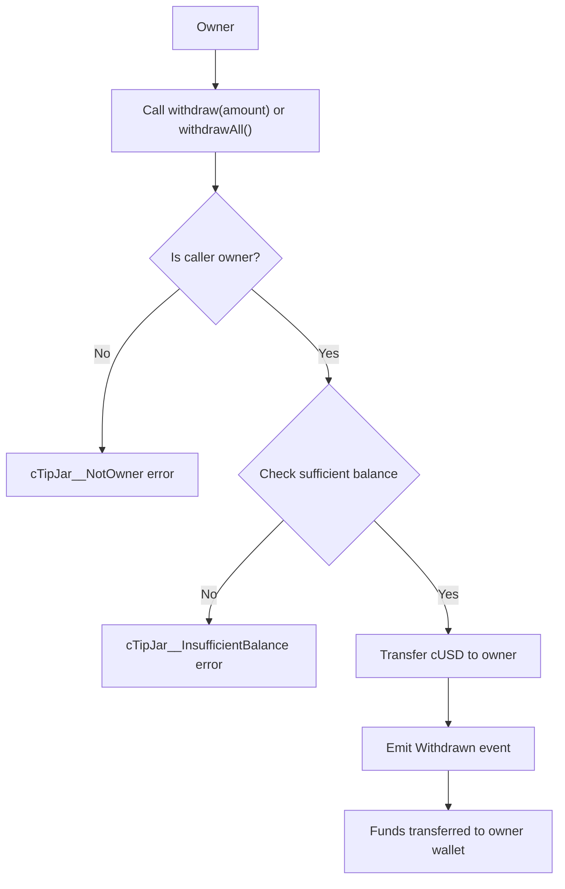

# cTipJar: Decentralized Stablecoin Tip Jar on Celo

[](https://github.com/your-repo/cTipJar/actions)
[](https://opensource.org/licenses/MIT)
[](https://soliditylang.org/)
[](https://book.getfoundry.sh/)

A secure, minimal smart contract for tipping in stablecoins on the Celo blockchain. Designed for simplicity, security, and educational purposes.


## Table of Contents

- [Overview](#overview)
- [Features](#features)
- [Architecture](#architecture)
- [System Flow](#system-flow)
- [Getting Started](#getting-started)
- [Usage](#usage)
- [Contract Interface](#contract-interface)
- [Testing](#testing)
- [Deployment](#deployment)
- [Contributing](#contributing)
- [License](#license)

## Overview

cTipJar is a decentralized tip jar contract deployed on the Celo network, allowing users to send tips in cUSD (Celo's stablecoin). Each instance is owned by a single recipient who can withdraw accumulated funds. The contract emphasizes security, gas efficiency, and clean code practices.

**Live Deployment**: [Celo Sepolia Testnet](https://celo-sepolia.blockscout.com/address/0xf822f815F1D0e498Bf9Dbd6e22929976278F6307)

## Features

- ✅ **Stablecoin Tipping**: Accepts cUSD tokens only
- ✅ **Single Owner**: One recipient per contract instance
- ✅ **Secure Withdrawals**: Owner-controlled fund extraction
- ✅ **Transparent Tracking**: Public view functions for stats
- ✅ **Gas Optimized**: Minimal operations for efficiency
- ✅ **Tested & Verified**: Comprehensive test suite and on-chain verification
- ✅ **EVM Compatible**: Works on Celo and other EVM chains

## Architecture

### Contract Structure



### Design Principles

- **Immutability**: Owner and token addresses set at deployment
- **Access Control**: Only owner can withdraw
- **Error Handling**: Custom errors for clarity
- **Checks-Effects-Interactions**: Secure transfer pattern
- **Minimalism**: Focused on core tipping functionality

## System Flow

### Tipping Flow



### Withdrawal Flow



## Getting Started

### Prerequisites

- [Foundry](https://book.getfoundry.sh/getting-started/installation) installed
- Git for cloning the repository
- A Celo-compatible wallet with testnet funds

### Installation

```bash
# Clone the repository
git clone https://github.com/your-repo/cTipJar.git
cd cTipJar

# Install dependencies
forge install

# Copy environment template
cp .env.example .env
# Edit .env with your configuration
```

### Environment Setup

Create a `.env` file with:

```env
# Celo Network RPC
CELO_SEPOLIA_RPC_URL=https://forno.celo-sepolia.celo-testnet.org

# Your wallet address
ADDRESS=0xYourWalletAddressHere
```

## Usage

### Build the Contract

```bash
forge build
```

### Run Tests

```bash
forge test
```

### Deploy to Testnet

For **Bash/Linux/Mac**:
```bash
./deploy.sh
```

For **Windows PowerShell**:
```powershell
.\deploy.ps1
```

Follow the prompts to enter your keystore password.

### Interact with Deployed Contract

#### Send a Tip

1. **Approve spending**:
   ```bash
   cast send 0x2F25deB3848C207fc8E0c34035B3Ba7fC157602B3 \
     "approve(address,uint256)" \
     0xf822f815F1D0e498Bf9Dbd6e22929976278F6307 \
     1000000000000000000 \
     --rpc-url $CELO_SEPOLIA_RPC_URL \
     --account yourAccount
   ```

2. **Send tip**:
   ```bash
   cast send 0xf822f815F1D0e498Bf9Dbd6e22929976278F6307 \
     "tip(uint256)" \
     1000000000000000000 \
     --rpc-url $CELO_SEPOLIA_RPC_URL \
     --account yourAccount
   ```

#### Withdraw Funds (Owner Only)

```bash
cast send 0xf822f815F1D0e498Bf9Dbd6e22929976278F6307 \
  "withdrawAll()" \
  --rpc-url $CELO_SEPOLIA_RPC_URL \
  --account ownerAccount
```

#### Check Stats

```bash
# Total received
cast call 0xf822f815F1D0e498Bf9Dbd6e22929976278F6307 \
  "totalReceived()" \
  --rpc-url $CELO_SEPOLIA_RPC_URL

# Tips from specific address
cast call 0xf822f815F1D0e498Bf9Dbd6e22929976278F6307 \
  "tipsFrom(address)" \
  0xTipperAddress \
  --rpc-url $CELO_SEPOLIA_RPC_URL
```

## Contract Interface

### Public Functions

| Function | Description | Parameters |
|----------|-------------|------------|
| `tip(uint256 amount)` | Send a tip in cUSD | amount: cUSD amount (wei) |
| `withdraw(uint256 amount)` | Withdraw specific amount | amount: cUSD amount (wei) |
| `withdrawAll()` | Withdraw all funds | - |
| `totalReceived()` | Get total cUSD received | - |
| `tipsFrom(address tipper)` | Get total from tipper | tipper: address |

### Events

- `Tipped(address indexed from, uint256 amount)`
- `Withdrawn(address indexed to, uint256 amount)`

### Errors

- `cTipJar__ZeroAmount()`: Invalid zero amount
- `cTipJar__NotOwner()`: Unauthorized access
- `cTipJar__TransferFailed()`: ERC20 transfer failure
- `cTipJar__InvalidAddress()`: Invalid address provided
- `cTipJar__InsufficientBalance()`: Insufficient contract balance
- `cTipJar__NoFundsToWithdraw()`: No funds available

## Testing

Run the comprehensive test suite:

```bash
# Run all tests
forge test

# Run with verbose output
forge test -v

# Run specific test
forge test --match-test testTipNonZeroAmount

# Gas report
forge test --gas-report
```

Test coverage includes:
- ✅ Successful tipping scenarios
- ✅ Error handling (zero amounts, unauthorized access)
- ✅ Withdrawal logic (partial and full)
- ✅ ERC20 interaction edge cases
- ✅ State variable updates

## Deployment

### Automated Deployment

Use the provided `deploy.sh` script for Celo Sepolia:

```bash
./deploy.sh
```

### Manual Deployment

```bash
source .env
forge script script/DeploycTipJar.s.sol \
  --rpc-url $CELO_SEPOLIA_RPC_URL \
  --account celoKey \
  --sender $ADDRESS \
  --broadcast \
  --verify \
  --verifier blockscout \
  --verifier-url https://celo-sepolia.blockscout.com/api
```

### Network Details

- **Chain ID**: 11142220
- **RPC URL**: https://forno.celo-sepolia.celo-testnet.org
- **Explorer**: https://celo-sepolia.blockscout.com
- **cUSD Contract**: 0x2F25deB3848C207fc8E0c34035B3Ba7fC157602B3

## Contributing

We welcome contributions! Please see our [Contributing Guide](CONTRIBUTING.md) for details.

### Development Workflow

1. Fork the repository
2. Create a feature branch: `git checkout -b feature/your-feature`
3. Make your changes and add tests
4. Run tests: `forge test`
5. Format code: `forge fmt`
6. Submit a pull request

### Code Standards

- Follow Solidity style guide
- Write comprehensive tests for new features
- Update documentation for API changes
- Ensure gas efficiency

### Reporting Issues

- Use GitHub Issues for bugs and feature requests
- Provide detailed reproduction steps
- Include contract addresses and transaction hashes when applicable

## License

This project is licensed under the MIT License - see the [LICENSE](LICENSE) file for details.

---

**Built with ❤️ for the Celo ecosystem. Empowering decentralized tipping with stablecoins.**

```shell
$ forge script script/Counter.s.sol:CounterScript --rpc-url <your_rpc_url> --private-key <your_private_key>
```

### Cast

```shell
$ cast <subcommand>
```

### Help

```shell
$ forge --help
$ anvil --help
$ cast --help
```
